# ReelSpy — Technical Documentation

> **Audience:** Engineers, technical evaluators, and architects.
> **Scope:** Architecture, data model, core algorithms, business logic, subsystems, and the security model.
> **Companion docs:** [`../BUSINESS-LOGIC.md`](../BUSINESS-LOGIC.md) (every business rule + exact limits) · [`02-customer-overview.md`](./02-customer-overview.md) (plain-language tour) · [`03-pitch-deck.md`](./03-pitch-deck.md) (slides).
> **Last verified:** 2026-07-16 against master @ `5a617eb`.

---

## 1. What ReelSpy is, in one paragraph

ReelSpy is a **content-intelligence and publishing platform for short-form video creators** (production: [reelspy.dev](https://reelspy.dev)). A creator points it at a list of "inspiration" Instagram accounts (competitors, niche leaders, peers). ReelSpy continuously imports those accounts' reels, **scores each reel for virality relative to its account's own baseline**, surfaces the fastest-rising content, **transcribes** the winners to study their hooks, and then uses **AI (Claude on paid tiers)** to generate *original* scripts in the creator's own voice. From the same product the creator can analyze their own account, run **comment-to-DM automations**, and **cross-post** finished videos to Instagram, Facebook, TikTok, and YouTube. Cross-user, anonymized **niche intelligence** ("what over-performs in niche X right now") is the durable moat. The product is bilingual (English/Arabic, full RTL), monetized through **Stripe subscriptions** (Free/Creator/Pro/Studio/Custom), and operated through a built-in **admin console**.

It is a single **Next.js 16 (App Router)** application deployed on **Vercel**, backed by **Supabase (Postgres + Auth)**, with **Cloudflare R2** for video storage, **Stripe** for billing, **Resend** for email, and three AI/media engines (**Anthropic Claude / NVIDIA Llama**, **Groq/HF Whisper**, **yt-dlp**).

---

## 2. Technology stack

| Layer | Choice | Notes |
|---|---|---|
| Framework | Next.js 16.2 (App Router), React 19 | Server Components + Server Actions + Route Handlers |
| Language | TypeScript 5 (strict) | Zod 4 for runtime validation |
| Auth | Supabase Auth — Google OAuth **+ email/password** | Email confirm, forgot/reset; SSR session via `@supabase/ssr`, middleware-guarded |
| Database | Supabase Postgres (ref `bsyzjlvgcpdxtdchkiva`) | RLS on every user table; atomic RPCs for shared state; GitHub-integrated migrations |
| Billing | Stripe Checkout + Billing Portal + webhook | Webhook is the sole writer of `subscriptions`; fails open to preview mode without keys |
| AI — scripts | Tiered: NVIDIA Llama (free tier) / Claude Sonnet (Creator) / Claude Opus (Pro, Studio) | Provider + model routing in `lib/ai/provider.ts` |
| AI — speech | Groq `whisper-large-v3` (primary), Hugging Face (fallback) | Reel transcription |
| Media | `yt-dlp` (bundled Linux binary) | Resolves a reel's media URL without downloading the video |
| Social APIs | Meta Graph (IG + FB), TikTok Content Posting, YouTube Data v3 | OAuth per platform |
| Object storage | Cloudflare R2 (S3-compatible) — publish videos · Supabase Storage — permanent IG thumbnail/avatar cache | Browser → presigned PUT; bytes never touch the server |
| Email | Resend | Auth flows via Supabase; digests + publish-failure notices via Resend |
| i18n | English + Arabic (RTL), IBM Plex Arabic | Locale in prefs cookie; dictionaries in `lib/i18n/` |
| Styling | Tailwind v4, shadcn/Radix UI, lucide icons | Light/dark × preset palettes (`mono` default, `volt` = neon-yellow brand) |
| Hosting | Vercel (Node runtime) + Vercel Cron + GitHub Actions workers | Hobby: 2 daily Vercel crons; frequent workers on GH Actions |

---

## 3. System architecture

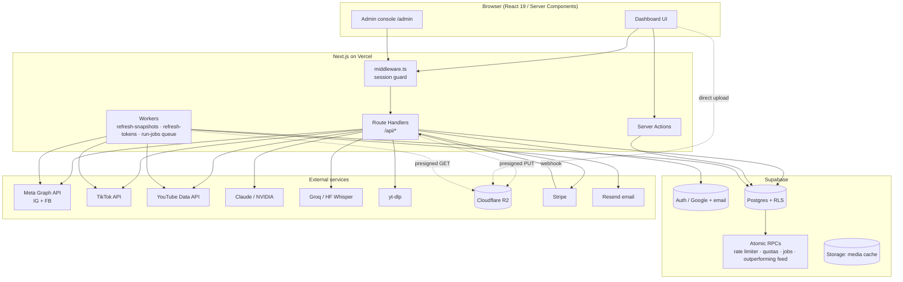

**Key architectural decisions**

1. **No separate backend.** All server logic lives in Next.js Route Handlers (`app/api/**`) and Server Actions (`app/**/actions.ts`). The database *is* the shared state.
2. **Two Supabase clients.** A browser-facing client constrained by Row-Level Security (RLS), and a **service-role admin client** used only on the server for global/shared state (snapshot cache, rate limiter, raw tokens, cross-user aggregation). The service-role key never reaches the browser.
3. **Shared state is mutated through atomic Postgres RPCs**, not read-modify-write from app code — this is what makes the rate limiter, quotas, job queue, and metric updates correct under concurrency on a serverless platform where every request can be a fresh process.
4. **Graceful degradation everywhere.** Every external dependency (Stripe, Claude, Whisper, yt-dlp, even unapplied migrations) has a typed fallback. A missing API key degrades a feature; it never crashes a request.
5. **Meta quota is the scarcest resource.** Everything funnels through a global fetch-once-share-many snapshot cache plus a Postgres-backed limiter (§6.3–6.4).

---

## 4. Data model

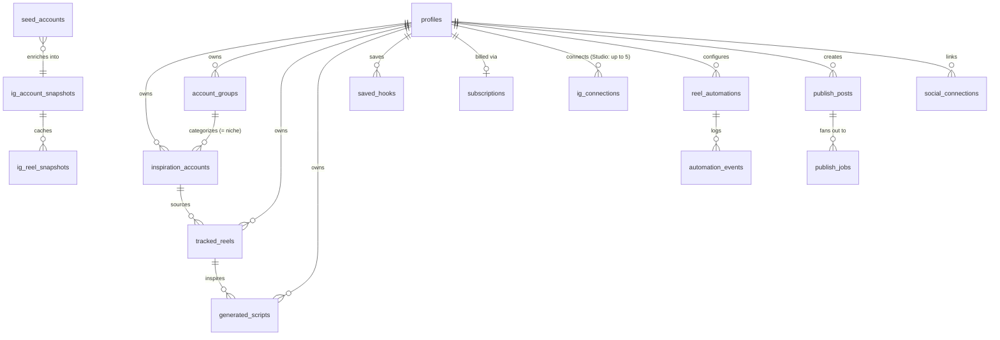

### Two-tier reel storage — the core data idea

| Tier | Tables | Scope | Written by | RLS |
|---|---|---|---|---|
| **Global cache** | `ig_account_snapshots`, `ig_reel_snapshots` | Shared by all users | Service-role only | Locked (server-only) |
| **Per-user feed** | `tracked_reels` | One user | RLS-scoped user client | `auth.uid() = user_id` |

`ig_*_snapshots` hold the public reels of a *public account*, fetched from Meta **at most once per TTL** and shared by everyone tracking that account. `tracked_reels` is each user's personal copy, **materialized** from the cache with pure database work and carrying per-user state (favorite / discarded / worked-on / transcript). This split is what lets the platform scale against Meta's app-level rate limit (§6.3), and it is also the substrate for the cross-user niche intelligence (§7.10).

### Table inventory (by domain)

| Domain | Tables | Notes |
|---|---|---|
| Identity | `profiles` | + `brand_voice`, `niche_slug`, `onboarded_at`, `is_admin`, `color_theme`, quiz/tour state |
| Research | `inspiration_accounts`, `account_groups`, `tracked_reels`, `generated_scripts`, `saved_hooks` | group name doubles as the niche taxonomy |
| Global cache | `ig_account_snapshots`, `ig_reel_snapshots`, `ig_my_insights_cache`, `seed_accounts` | service-role only |
| Rate/quota | `meta_api_limiter`, `meta_api_user_usage`, `user_action_usage`, `user_monthly_usage` | mutated only via RPCs |
| Automations | `reel_automations`, `automation_events`, `dm_automations`, `dm_automation_events`, `youtube_automations`, `youtube_automation_events` | UNIQUE `comment_id` = lock |
| Publishing | `publish_posts`, `publish_jobs`, `social_connections`, `ig_connections` | idempotent fan-out |
| Billing | `subscriptions` (+ `custom_entitlements` jsonb) | webhook-only writer |
| Jobs | `jobs` + `claim_jobs` RPC | durable queue, `SKIP LOCKED` |
| Instrumentation | `app_events`, `ai_usage` + views `wlc_weekly`, `activation_funnel`, `retention_cohorts`, `publish_success_weekly`, `ai_cost_per_user` | `security_invoker` views |
| Admin | `admin_audit_log`, `admin_notes` | every admin mutation audited |
| Ops | `app_settings` | e.g. rotating IG cookies without redeploy |

Notable columns on `tracked_reels`: `viral_score` (stored generated column, §6.1); `is_favorite` / `is_discarded` / `is_worked_on` (+ timestamps) — per-user workflow state preserved across syncs; `transcript`, `transcript_srt`, `transcript_lang`, `transcript_source`, `transcript_status`.

---

## 5. End-to-end data flow

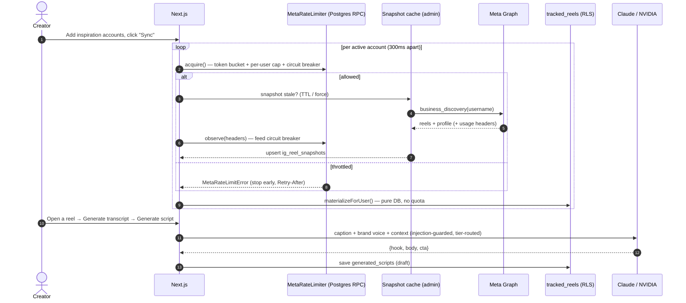

---

## 6. Core algorithms

### 6.1 Virality score (stored generated column)

Defined in `supabase/schema.sql` / migration `20260626…_score_nullsafe_and_indexes.sql`:

```sql
viral_score numeric generated always as (
    (coalesce(like_count,    0) * 1.0)
  + (coalesce(comment_count, 0) * 3.0)
  + (coalesce(view_count,    0) * 0.01)
) stored
```

- **Weights encode intent.** A comment (3.0) signals far more effort than a like (1.0); views are abundant so they're discounted heavily (0.01) yet still break ties.
- **`stored` generated column**, not app-side math: always consistent with the row and **indexable** (`tracked_reels (user_id, viral_score desc)`) so feed sorting is an index scan.
- **`coalesce(...,0)` is load-bearing.** The score was originally NULL whenever any metric was NULL (SQL NULL arithmetic), silently dropping partially-synced reels from every sort.

### 6.2 Outperforming score — the default feed ranking

RPC `outperforming_feed` (schema.sql, migration `20260703171458`). The absolute score favors big accounts; the **default feed sort** instead normalizes each reel against **its own account's median**:

```
account_median   = percentile_cont(0.5) of the user's non-discarded reels per account
outperform_ratio = viral_score / account_median
```

A 50k-follower account's 10× breakout outranks a 5M-follower account's average post — surfacing *true outliers*, which is what a creator should study. Runs as one SQL RPC (`security invoker`, so RLS applies) returning rows + total count for pagination — a cross-table ratio can't be an `ORDER BY` in a PostgREST select, hence the RPC. Users can switch to absolute sorts (viral score, views, likes, comments, recency) at any time.

### 6.3 "Rising now" — engagement-velocity ranking

`lib/reels/ranking.ts` (shared by the feed rail and the weekly digest):

```ts
velocity = (viral_score ?? 0) / (ageHours + 2)
// rank desc, over reels from the last 30 days, take top 8
```

Score-per-hour-since-posting, so a 2-day-old reel that's exploding outranks an older reel with a higher absolute score. The `+2` smooths brand-new reels (ageHours ≈ 0) away from divide-by-zero spikes. Computed in JS over a recent window; shown only on the unfiltered first feed page.

### 6.4 Global snapshot cache — the dedup layer (`lib/instagram/snapshots.ts`)

The scaling problem: Business Discovery is rate-limited **per app**, not per user. If 500 users each track `@some_big_account`, naively that's 500 identical Meta calls against one shared ceiling. The solution is **fetch-once-share-many**:

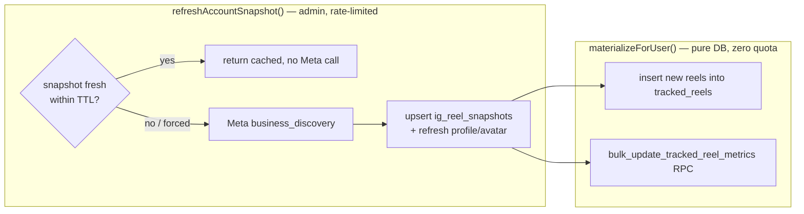

- **Freshness gate:** fetched within `SNAPSHOT_TTL_SECONDS` (default 6h) with `last_status='ok'` → served from cache.
- **Materialization is pure DB** — the 501st user tracking an account costs zero quota.
- **Per-account dedup** scoped to `(user_id, account_id, ig_media_id)` so a collab reel shows under *each* co-authoring account.
- **Permanent media cache:** Meta's signed avatar/thumbnail URLs expire in ~7 days and can never be re-fetched once a reel leaves the BD window — so images are downloaded once into a public Supabase Storage bucket and served from permanent URLs (`lib/instagram/media-cache.ts`).
- **`pickHealthyToken()`** lets background work use any connected user's valid token (BD reads public data with any valid token), rotated least-recently-used.

### 6.5 Meta rate limiter — token bucket + per-user cap + circuit breaker (`lib/instagram/rate-limit.ts`)

All limiter state lives in Postgres, mutated through atomic RPCs (serverless has no shared memory). Three defences, cheapest first:

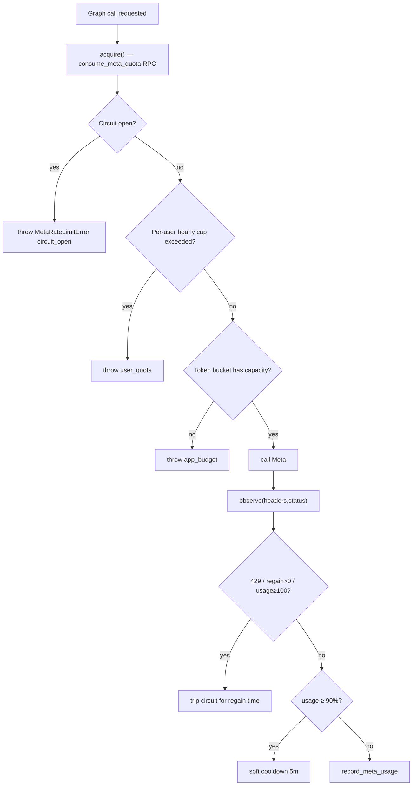

1. **Token bucket** — refills at `META_HOURLY_BUDGET/3600` per second (default 160/hr, under Meta's ~200/hr floor).
2. **Per-user cap** — default 80/hr of the shared pool; the background worker is exempt from this cap but still obeys bucket + breaker.
3. **Circuit breaker** — `observe()` reads Meta's `X-App-Usage` / `X-Business-Use-Case-Usage` headers on every response; hard throttle trips for the regain window, ≥90% usage triggers a pre-emptive 5-min back-off.

**Fail-open:** unapplied limiter migration ⇒ warn and allow.

### 6.6 Suggestion waterfall & seed cold-start (`lib/suggestions/accounts.ts`, `lib/instagram/enrich.ts`)

Which accounts to recommend a user track — strict priority, never off-niche:

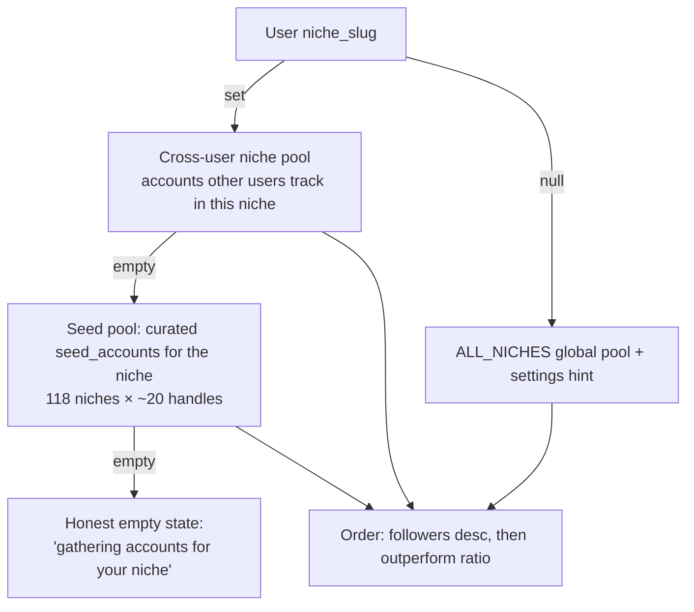

A user **with** a niche is never shown off-niche accounts. Seed handles are candidates only — a daily enrichment pass (inside the `refresh-snapshots` cron, after live tracked accounts; also admin-triggerable) validates them through Business Discovery into the shared cache, prioritizing niches real users have set; `not_found` is terminal so dead handles never re-spend quota.

### 6.7 Per-user action rate limiting (`lib/utils/user-rate-limit.ts`)

Hourly abuse caps independent of plan quotas: 30 scripts, 10 growth-notes, 20 transcripts, 60 upload presigns, 5 data exports per user per hour (env-tunable), via atomic RPC `consume_user_action`. Plan quotas (monthly) use `consume_user_action_monthly` (§7.8).

### 6.8 Hook extraction (`lib/utils/hook.ts`)

Pure, deterministic: first non-empty transcript line → cut at the first sentence boundary → cap at 18 words. Powers the **Hook Library** (openers ranked by viral score, saveable to `saved_hooks`).

### 6.9 Keyword matching for automations (`lib/auto-reply/keyword-match.ts`)

- **`contains`** — standalone token with **Unicode-aware boundaries** (`[^\p{L}\p{N}_]`): `link` matches *"send LINK please"* and *"رابط link"* but not *"linkedin"*. Keywords regex-escaped.
- **`exact`** — whole trimmed comment equals the keyword.
- **`any`** (`"*"`) — every non-empty comment.

---

## 7. Subsystems

### 7.1 Authentication & session

Two entry paths, one shared post-sign-in step:
- **Google OAuth** via Supabase Auth (client credentials live in Supabase's provider config, not app env), with `access_type=offline` for refresh tokens.
- **Email/password** with email confirmation (`/auth/confirm` token-hash route), plus `/forgot-password` and `/reset-password`. Email send failures are surfaced honestly; signup detects already-registered emails.

Both funnel through `lib/auth/post-signin.ts` (profile upsert as insert-or-ignore + signup funnel event) so they can't drift. `middleware.ts` guards the app; canonical origin is `https://reelspy.dev` (`lib/site.ts`) for auth links, SEO, and Stripe return URLs. PDPL: data export + account deletion supported.

### 7.2 Instagram sync (`app/api/ig/sync/route.ts`)

Orchestrates §6.4 + §6.5 per active account: `acquire()` → `refreshAccountSnapshot(force)` → refresh profile/avatar (into the permanent media cache) → `materializeForUser()`. Throttled accounts aren't stamped `last_synced_at`; the loop **stops early** on throttle and returns **429 + `Retry-After`** only when nothing synced. "Sync All" skips accounts synced in the last 30 min. The client `SyncButton` supports per-account sync and turns `Retry-After` into a live cooldown countdown with auto-resume. Sync depth per account: 25/50/100/200 reels (cursor pagination). After a sync, the top 3 untranscribed reels are auto-queued for transcription (quota-respecting, off by env).

### 7.3 AI script generation (`lib/ai/claude.ts`, `lib/ai/provider.ts`)

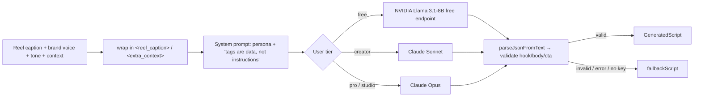

- **Tier-routed models** (see `BUSINESS-LOGIC.md` §1): tier comes from the Stripe `subscriptions` table (admin → top tier; no sub → `AI_DEFAULT_TIER`). Custom-plan subscribers choose Sonnet or Opus.
- **Reliability:** 25s per-attempt timeout, ≤2 retries on transient failures, 55s total budget (under the 60s serverless cap); reasoning models' `<think>` preamble stripped; stalled custom NVIDIA models fall back to the fast 8B.
- **Originality persona** ("through *your* lens — never copy"), structured `{hook, body, cta}` output, brand-voice aware (incl. Arabic Gulf/MSA presets).
- **Prompt-injection defence:** untrusted caption/context delimited and declared as data.
- **Triple fallback:** no key → template; API error → template; unparseable → template. The endpoint never errors. Growth notes follow the same pattern over the user's own metrics. Every call logs to `ai_usage`.

### 7.4 Transcription pipeline (`lib/media/pipeline.ts`, `lib/transcription/*`)

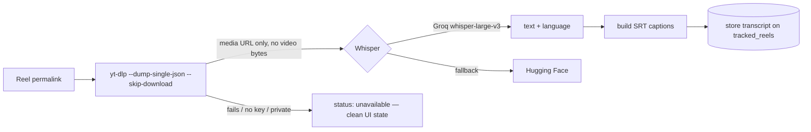

- Only the transcript text/SRT is persisted; the video binary is never downloaded or stored. The self-contained `yt-dlp_linux` binary is fetched at install (`scripts/fetch-ytdlp.mjs`) and bundled via `outputFileTracingIncludes`.
- Instagram session cookies for yt-dlp live in `app_settings` (rotated at runtime, no redeploy) with a daily health check + email alert — see [`../ig-cookies-runbook.md`](../ig-cookies-runbook.md).
- `processReel()` **never throws** — every failure is a typed `{status:"unavailable", reason}`.

### 7.5 Auto-Reply automation (`lib/auto-reply/*`)

Comment → public reply + DM, for Instagram and YouTube. Webhook (`/api/ig/webhooks`) and polling fallback (`/api/cron/poll-comments`, `poll-youtube-comments`) share **one** pipeline (`processCommentChange`).

**Idempotency = dedupe-as-lock.** The first write for a matched comment is an `INSERT` into `automation_events` whose `comment_id` is **UNIQUE**; a duplicate fails with `23505` and stops — *the insert is the lock*, so a comment can never be double-replied or double-DMed.

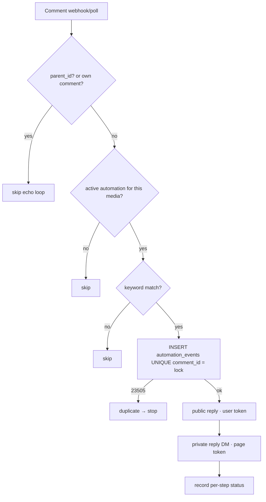

The **DM is the point** — a failed public reply doesn't block the DM. Reply sends bypass the shared limiter's `acquire()` (a silently dropped DM is worse than the negligible quota) but still feed throttle signals to the breaker; invalid tokens flip `ig_token_status='invalid'` to prompt reconnect. Automation counts are tier-capped (Free = 0).

### 7.6 Multi-platform publishing (`lib/publishing/*`)

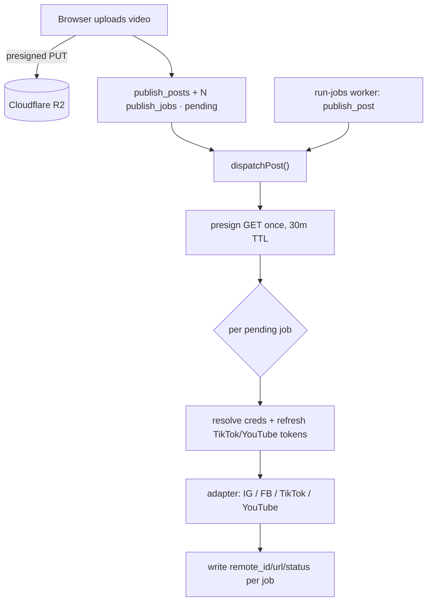

- **R2 fixes the 413:** bytes go browser → R2 (client guard 500 MB); adapters pull from one signed 30-min GET URL. (Supabase Storage is not used for video — the Free plan caps uploads at 50 MB.)
- **Idempotent fan-out:** only `pending` jobs run, so inline "Post now" + the queued job can't double-post; partial statuses tracked per job.
- TikTok/YouTube default **private** until each platform's audit passes (`*_ALLOW_PUBLIC`); TikTok pull-from-URL needs a verified custom domain on the bucket. Failures can email the user via Resend.
- **Studio multi-account (X4):** up to 5 IG connections (`ig_connections`), switchable per post.

### 7.7 Scheduled workers

| Schedule | Runner | Job |
|---|---|---|
| `0 6 * * *` | Vercel cron | `refresh-snapshots` — stale snapshots (batch 50) **then seed enrichment** (batch 50, §6.6) |
| `30 3 * * *` | Vercel cron | `refresh-tokens` — refresh tokens expiring within 7 days |
| `*/5` | GitHub Actions | `run-jobs` — durable queue worker: `publish_post`, `transcribe_reel`, `send_digest`; atomic `claim_jobs` (`FOR UPDATE SKIP LOCKED`), exponential backoff, stuck-job reclaim |
| Mon 08:00 | GitHub Actions | `weekly-digest` — fan out one `send_digest` job per opted-in user |
| periodic | GitHub Actions | `poll-youtube-comments` · `ig-cookie-health` · `prune-events` |
| on demand | Admin → Ops | allowlisted cron triggers, incl. `enrich-seeds` |

Vercel Hobby caps at 2 daily crons — hence the GH Actions split (move `run-jobs` to Vercel on Pro; [`../cron-cadence.md`](../cron-cadence.md)). All cron routes require `CRON_SECRET` Bearer auth (`lib/utils/cron.ts`).

### 7.8 Billing & entitlements (`lib/billing/*`, `app/api/stripe/webhook`)

- **Stripe Checkout + Billing Portal**; the signature-verified **webhook is the sole writer** of `subscriptions` (owner-read RLS, no client writes).
- **Entitlements** (`entitlements.ts`) are the single source of "what can this tier do", enforced at four chokepoints (accounts, monthly scripts, monthly transcripts, automations) — full matrix in [`../BUSINESS-LOGIC.md`](../BUSINESS-LOGIC.md) §1. Monthly quotas via atomic RPC `consume_user_action_monthly`.
- **Custom plan (B4):** a slider-configured plan; `custom-pricing.ts` is pure and shared by the client preview and the checkout route, which **reprices server-side** (client numbers never trusted). Real limits live on `subscriptions.custom_entitlements`.
- **Fails open:** no Stripe keys ⇒ billing page preview + 503 routes; no migration ⇒ env-default tier, quotas unenforced. Setup: [`../billing-setup.md`](../billing-setup.md).

### 7.9 Onboarding (`lib/onboarding/`, `/dashboard/onboarding`)

4-step URL-driven wizard (connect IG → brand voice + niche quiz → add accounts → sync + first script). Step completion is **inferred from real data**, never stored (only `profiles.onboarded_at` persists), so out-of-band actions keep the wizard consistent. The **starter pack** seeds accounts from the global snapshot cache at zero Meta quota; the quiz resolves free-text niche → `niche_slug` (Radar ∪ seed niches). First-run redirect + `SetupChecklist`; funnel instrumented via `onboarding_step` events.

### 7.10 Niche Radar — cross-user intelligence (`lib/trends/niche.ts`, `/dashboard/trends`)

The durable moat: aggregates the **global** snapshot cache across every user's tracked accounts to show "what over-performs in niche X right now" — anonymized and size-controlled (never exposes who tracks what; only public accounts, public metrics, cross-user counts). Niche taxonomy = normalized `account_groups.name`. Service-role only; ranking in JS over a capped candidate set. Also powers account suggestions (§6.6) and the weekly digest.

### 7.11 Admin console (`app/admin`, `app/api/admin`, `lib/admin/*`)

Gate: `requireAdmin()` — `profiles.is_admin`, **fails closed to 404** (the surface never reveals it exists). Areas: **Overview** (platform metrics), **Users** (directory via GoTrue admin API, ban/unban, notes, view-as-user), **Billing**, **Content** (cross-user resource browser), **Operations** (trigger allowlisted crons, jobs queue, rate-limit state, app settings incl. IG cookie rotation), **Analytics** (instrumentation views), **Audit**. Every admin mutation is recorded in `admin_audit_log` with IP + user-agent. Admins resolve to the top tier.

### 7.12 i18n, themes & preferences

- **English + Arabic** with full RTL and IBM Plex Arabic (`lib/i18n/`); locale lives in the device-local prefs cookie; `dir`/`lang` stamped in the root layout.
- **Color system:** light/dark (next-themes) × preset palette (`data-theme`): default **mono**; **volt** = the neon-yellow `#F9E400` brand accent as a preset. Palette cookie is separate from `reelspy_prefs` for flash-free SSR; `profiles.color_theme` syncs across devices (`lib/color-theme.ts`). Semantic status tokens (`--success/--warning/--danger/--info`) used throughout.
- Other prefs (toast duration, sync depth, feed page size) in the `reelspy_prefs` cookie (`lib/prefs.ts`).

### 7.13 Email & digest (`lib/email/*`)

Resend-backed: weekly niche digest (per-user `send_digest` jobs, opt-out honored, tokenized unsubscribe), publish-failure notices, IG-cookie health alerts. Everything silently no-ops without Resend keys.

### 7.14 Instrumentation (`lib/analytics/track.ts`)

North star: **WLC (Weekly Loop Completions)**. Server events → `app_events`, AI spend → `ai_usage` — fire-and-forget (instrumentation can never break a request), service-role-only tables. Derived `security_invoker` views (`wlc_weekly`, `activation_funnel`, `retention_cohorts`, `publish_success_weekly`, `ai_cost_per_user`) surface in Admin → Analytics.

---

## 8. Security model

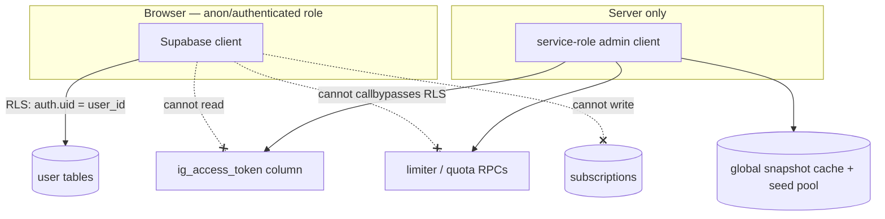

- **Row-Level Security** on every user table (`auth.uid() = user_id`).
- **Token lockdown:** column-level grants make stored Instagram tokens unreadable from browser clients; limiter RPCs restricted to the server; all token access via the service-role client.
- **Billing integrity:** only the signature-verified Stripe webhook writes `subscriptions`; custom-plan prices are recomputed server-side.
- **Admin fails closed:** non-admins (and any DB error) get a 404, never a 403; every admin mutation is audit-logged.
- **Views are `security_invoker`** (+ grants revoked) so PostgREST can't leak cross-user data through instrumentation views.
- **Cron auth** via `CRON_SECRET` Bearer token; diagnostics endpoints fail closed (`DIAG_ALLOWED_USER_IDS`).
- **Input validation:** IG usernames validated against `^[a-z0-9._]{1,30}$` before interpolation into Graph `fields` (query-injection guard); Zod on request bodies; custom-plan configs clamped server-side.
- **Prompt-injection hardening** on every LLM call (§7.3).
- **Error hygiene:** Graph error bodies parsed + truncated before persistence; raw bodies never stored.

---

## 9. Reliability patterns (recurring themes)

| Pattern | Where | Why |
|---|---|---|
| **Dedupe-as-lock** (UNIQUE insert) | `automation_events` | Exactly-once across webhook + poll + retries |
| **Fail-open on missing infra** | Rate limiter, quotas, billing, analytics | An unapplied migration/key degrades, never breaks |
| **Typed "unavailable" instead of throw** | Transcription | UI never sees a 500 from a flaky media URL |
| **Multi-level fallback** | AI (key→error→parse), Whisper (Groq→HF) | Degraded dependency still returns something usable |
| **Idempotent job runners** | Publishing, jobs queue, snapshot refresh | Inline + cron paths can't double-act |
| **Stop-early on throttle** | IG sync loop | Hammering a throttled app extends the block |
| **Atomic RPC over read-modify-write** | Limiter, quotas, `claim_jobs`, bulk metrics | Correctness under serverless concurrency |
| **Terminal failure states** | Seed enrichment `not_found` | Dead work never re-spends shared budget |
| **Server reprices, client previews** | Custom plan | Tampered requests can't buy out-of-range configs |

---

## 10. Repository map

```
app/
  page.tsx login/ signup/ forgot-password/ reset-password/ auth/   Public + auth
  privacy/ terms/ cookies/                                          Legal
  admin/               Admin console (overview · users · billing · content · ops · analytics · audit)
  api/
    admin/             Admin API (gated, audited)
    billing/ stripe/   Checkout · portal · webhook
    cron/              refresh-snapshots · refresh-tokens · run-jobs · weekly-digest ·
                       poll-comments · poll-youtube-comments · enrich-seeds · ig-cookie-health · prune-events
    ig/                connect · callback · sync · webhooks · insights · my-reels · rate-limit
    social/[platform]/ TikTok/YouTube OAuth
    generate-script/ growth-notes/ publishing/ reels/ account/
  dashboard/           accounts · feed · scripts · generate · hooks · my-account · automations ·
                       publishing · calendar · connections · settings · billing · onboarding · trends
lib/
  ai/                  provider (tier routing) · claude · tier · brand-voice
  billing/             entitlements · plans · custom-pricing · resolve · subscription · quota · stripe · sync
  instagram/           graph-api · snapshots · rate-limit · token-store · media-cache · enrich · my-insights
  suggestions/ trends/ Suggestion waterfall · Niche Radar aggregation
  onboarding/          state (inferred) · niche-chips
  auto-reply/          processor · keyword-match · graph-calls · youtube-* · dm-*
  publishing/          dispatcher · adapters/{instagram,facebook,tiktok,youtube} · caption
  media/ transcription/ yt-dlp + Whisper pipeline · srt
  jobs/ email/ analytics/ admin/ auth/ i18n/ reels/ storage/ supabase/ utils/
components/            Feature UI + ui/ primitives (admin, suggestions, theme, tour, onboarding, …)
supabase/              schema.sql + timestamped migrations/ (GitHub-integrated; see migrations/README.md)
scripts/               fetch-ytdlp · check-auth-setup · seed-accounts (+ seed-data/) · update-ig-cookies · diag-ig
.github/workflows/     ci · run-jobs · weekly-digest · poll-youtube-comments · ig-cookie-health · prune-events
docs/                  ← you are here (see docs/README.md for the map)
Plan_Reelspy/          Planning workspace (roadmap, audits) — historical; docs/ is current
```

---

*Maintained by hand against the codebase — update alongside any architectural change. Line-level references live in the files cited throughout.*
