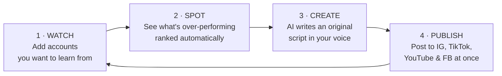
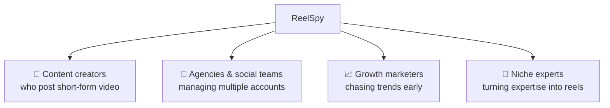

# ReelSpy — Product Overview

> **For everyone.** No code, no jargon. This is what ReelSpy does and why it helps you grow.
> **More:** [`01-technical-documentation.md`](./01-technical-documentation.md) (for engineers) · [`../BUSINESS-LOGIC.md`](../BUSINESS-LOGIC.md) (plans & limits in detail) · [`03-pitch-deck.md`](./03-pitch-deck.md) (slides).
> Live at **[reelspy.dev](https://reelspy.dev)** · English & Arabic (full RTL support).

---

## The one-liner

> **ReelSpy is your unfair advantage for short-form video.** It watches the creators you admire, tells you exactly which of their reels are *over-performing right now*, learns what made them work, and helps you turn that insight into your own original videos — then posts them everywhere for you.

---

## The problem it solves

Growing on Reels, TikTok, and Shorts is a guessing game:

- 😩 **You don't know what's working** until it's already old news.
- 🕵️ **Manually stalking competitors** eats hours and you still miss the breakout reels.
- ✍️ **Staring at a blank page** every time you need a new script.
- 🔁 **Re-uploading the same video** to four platforms, one tedious upload at a time.
- 💬 **Replying to every "link please" comment** by hand, or losing the lead.

**ReelSpy turns all of that into a few clicks.**

---

## How it works — the 4-step loop

1. **Watch** — Tell ReelSpy which Instagram accounts inspire you. Don't know where to start? Take the **niche quiz** and ReelSpy suggests proven accounts in your niche — biggest creators first.
2. **Spot** — ReelSpy imports their reels and ranks them by how much each one **beats that account's own average** — so a small account's breakout hit outranks a big account's ordinary post. A **"Rising Now"** shelf catches reels exploding *this week*.
3. **Create** — Pick a reel for inspiration. ReelSpy can **transcribe** it so you study the exact hook, then **AI writes you an original script** — hook, body, call-to-action — in *your* brand voice (English or Arabic, Gulf or MSA). Never a copy.
4. **Publish** — Upload your finished video once and **cross-post** it to Instagram, Facebook, TikTok, and YouTube. Schedule it for later if you like.

---

## What's inside — feature by feature

| 🧭 Section | What it does for you |
|---|---|
| **Dashboard** | Home base — activity snapshot, setup checklist, what's rising. |
| **Onboarding** | 4-step guided start: connect Instagram, set your brand voice & niche, add accounts (or grab a ready-made starter pack), sync your first reels. |
| **Accounts** | Add creators to learn from, organized into groups. Bulk-import who you follow. Smart **suggestions** for your niche. |
| **Feed** | Every tracked reel, ranked by **out-performance** (beats-its-own-average), with virality score sorting and a **"Rising Now"** shelf. Favorite, hide, or mark reels done. |
| **Trends** | 📈 **Niche Radar** — what's over-performing *across your whole niche right now*, powered by anonymized intelligence across all ReelSpy users. |
| **Hook Library** | The opening line of every transcribed reel in one searchable list. Save the best ones. Study what stops the scroll, then remix it. |
| **Scripts** | AI-generated original scripts saved as drafts, ready to film. |
| **My IG** | Analytics on **your own** account, plus AI growth tips based on your real numbers. |
| **Auto-Reply** | Someone comments a keyword ("link") → instant public reply **and** a DM with your link — Instagram *and* YouTube. |
| **Publishing** | Compose once, post to IG, FB, TikTok & YouTube. Per-platform captions, scheduling. Studios can switch between up to 5 Instagram accounts. |
| **Calendar** | Scheduled and drafted content laid out by date, drag-and-drop. |
| **Connections** | One place to connect/disconnect every social account. |
| **Billing** | Pick a plan — or **build your own** with sliders. |
| **Settings** | Brand voice, niche, language (English/عربي), light/dark + color themes, preferences, data export. |

---

## The features that make people say "wow"

### 📊 Out-performance ranking — find *true* outliers
Every reel gets a virality score (comments count most, likes next, views least — a comment means someone *cared*). But the feed's default ranking goes further: it compares each reel to **that account's own average**, so you see which reels *broke out* — not just which accounts are big. That's the content worth studying.

### 📈 Niche Radar — your niche's pulse
ReelSpy anonymously aggregates what *all* its users track. The Trends page shows what's over-performing across your entire niche right now — intelligence no single account watcher can give you.

### 🎙️ Transcribe any reel → steal the *structure*, not the content
Pull the spoken words out of any reel and see its hook. The **Hook Library** collects every opener so you can see the patterns behind viral openings — then build your own.

### 🤖 AI scripts in *your* voice
Point at an inspiration reel and AI writes a fresh **hook + body + CTA** — its own topic, its own angle, never a copy. It uses your saved **brand voice**, works in English and Arabic (Gulf or MSA style), and paid plans run on **Claude**, the same AI many pros use.

### 💬 Comment-to-DM on autopilot
Set a keyword and a message once. Every matching comment gets an instant public reply *and* a private DM — 24/7, on Instagram and YouTube. It never double-replies and never replies to itself.

### 🚀 Post everywhere, once
Upload your video a single time and send it to **Instagram, Facebook, TikTok, and YouTube** together — each with its own caption. Schedule it and walk away.

---

## Plans

| | Free | Creator | Pro | Studio |
|---|---|---|---|---|
| Price | AED 0 | AED 49/mo | AED 149/mo | AED 349/mo |
| Tracked accounts | 3 | 30 | 50 | 100 |
| AI scripts / month | 10 | 60 | 200 | Unlimited |
| Transcripts / month | 5 | 30 | 100 | Unlimited |
| Auto-replies | — | 15 | 30 | 60 |
| Publishing | — | ✔ | ✔ | ✔ + 5 IG accounts |
| AI model | Standard | Claude Sonnet | Claude Opus | Claude Opus |

Don't fit a box? **Build your own plan** — sliders for accounts, scripts, auto-replies, and publish targets, priced live. Full details: [`../BUSINESS-LOGIC.md`](../BUSINESS-LOGIC.md).

---

## Who it's for

If you make short-form video and want to **spend less time guessing and more time creating**, ReelSpy is for you.

---

## Why creators choose ReelSpy

| Without ReelSpy | With ReelSpy |
|---|---|
| Scroll competitors for hours, hope you spot a trend | Breakout reels surfaced and ranked automatically |
| Guess what made a reel work | See the exact hook and structure, transcribed |
| Blank page every time you script | An original script drafted in seconds, in your voice |
| Upload the same video 4 times | Upload once, post everywhere |
| Miss leads in your comments | Every keyword comment answered + DM'd instantly |
| Watch your own stats and wonder what to change | Specific, data-driven growth tips on demand |

---

## Your data is yours

- You only ever see **your own** accounts, reels, and scripts — everything is isolated per user. Niche intelligence is **anonymized** — nobody can see what *you* track.
- Your social logins are stored securely on the server and **never exposed to the browser**.
- ReelSpy reads only **public** information from the accounts you choose to track.
- Videos you upload are stored privately and shared only with the platforms you publish to.
- You can **export all your data** or delete your account at any time.

---

## In short

> **ReelSpy compresses the whole content loop — research → inspiration → scripting → publishing → engagement — into one tool.** Watch the right creators, catch true outliers early, create original videos faster, and grow on every platform at once.

*Ready to see it? Sign up at [reelspy.dev](https://reelspy.dev), take the niche quiz, and hit Sync.*
