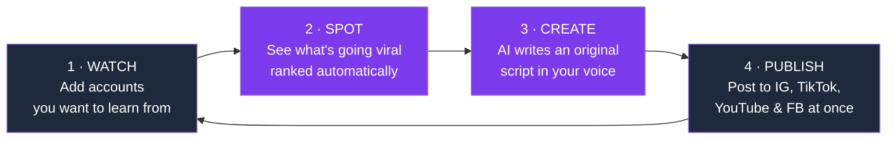
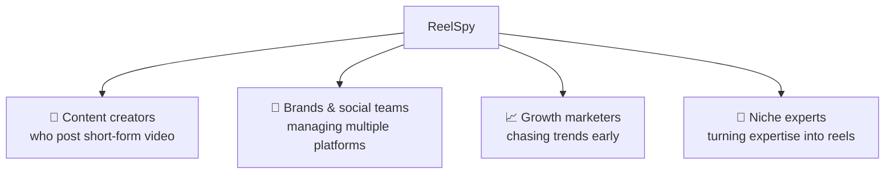

# ReelSpy — Product Overview

> **For everyone.** No code, no jargon. This is what ReelSpy does and why it helps you grow.
> **More:** [`01-technical-documentation.md`](./01-technical-documentation.md) (for engineers) · [`03-pitch-deck.md`](./03-pitch-deck.md) (slides).

---

## The one-liner

> **ReelSpy is your unfair advantage for short-form video.** It watches the creators you admire, tells you exactly which of their reels are *blowing up right now*, learns what made them work, and helps you turn that insight into your own original videos — then posts them everywhere for you.

---

## The problem it solves

Growing on Reels, TikTok, and Shorts is a guessing game:

- 😩 **You don't know what's working** until it's already old news.
- 🕵️ **Manually stalking competitors** eats hours and you still miss the breakout reels.
- ✍️ **Staring at a blank page** every time you need a new script.
- 🔁 **Re-uploading the same video** to four platforms, one tedious upload at a time.
- 💬 **Replying to every "link please" comment** by hand, or losing the lead.

**ReelSpy turns all of that into a few clicks.**

---

## How it works — the 4-step loop

1. **Watch** — Tell ReelSpy which Instagram accounts inspire you (competitors, niche leaders, people in your lane). Group them however you like — "Angular", "Memes", "Fitness".
2. **Spot** — ReelSpy imports their reels and **scores each one for virality**, then shows you a **"Rising Now"** shelf of the fastest-growing reels so you catch trends *while they're hot*.
3. **Create** — Pick a reel for inspiration. ReelSpy can **transcribe** it so you can study the exact hook, then **Claude AI writes you an original script** — hook, body, and call-to-action — in *your* voice. Never a copy.
4. **Publish** — Upload your finished video once and **cross-post** it to Instagram, Facebook, TikTok, and YouTube. Schedule it for later if you like.

---

## What's inside — feature by feature

| 🧭 Section | What it does for you |
|---|---|
| **Dashboard** | Your home base — a snapshot of activity and what's rising. |
| **Accounts** | Add the creators you want to learn from. Organize them into groups. Bulk-import who you follow. |
| **Feed** | Every tracked reel, sortable by **virality score**, with a **"Rising Now"** shelf of breakout content. Favorite, hide, or mark reels as "done". |
| **Hook Library** | The opening line of every reel you've transcribed, all in one searchable list — study what stops the scroll, then remix it. |
| **Scripts** | AI-generated original scripts saved as drafts, ready to film. |
| **My IG** | Analytics on **your own** account, plus 5 AI-written, data-driven growth tips based on your real numbers. |
| **Auto-Reply** | When someone comments a keyword (like "link"), ReelSpy automatically replies publicly **and** sends them a DM with your link — for Instagram *and* YouTube. |
| **Publishing** | Compose once, post to IG, FB, TikTok & YouTube. Per-platform captions, scheduling, private/public control. |
| **Calendar** | See your scheduled and drafted content laid out by date. |
| **Connections** | One place to connect/disconnect every social account. |
| **Settings** | Preferences and your Instagram connection. |

---

## The features that make people say "wow"

### 🔥 Virality score & "Rising Now"
Every reel gets a single virality number, weighted so **comments count most, likes next, views least** — because a comment means someone *cared*. "Rising Now" goes further: it ranks by **how fast a reel is growing per hour**, so a 2-day-old rocket beats an old reel with more total likes. You catch the wave early.

### 🎙️ Transcribe any reel → steal the *structure*, not the content
ReelSpy can pull the spoken words out of a reel and show you its hook. The **Hook Library** collects every opener you've captured so you can see the patterns behind viral openings — then build your own.

### 🤖 AI scripts in *your* voice
Point at an inspiration reel and Claude AI writes you a fresh **hook + body + call-to-action** — its own topic, its own angle, never a copy of the original. Built to sound like *you*, not a generic bot.

### 💬 Comment-to-DM on autopilot
Set a keyword and a message once. From then on, every matching comment gets an instant public reply *and* a private DM with your link — 24/7, on Instagram and YouTube. It never double-replies and never replies to itself.

### 🚀 Post everywhere, once
Upload your video a single time and send it to **Instagram, Facebook, TikTok, and YouTube** together — each with its own caption if you want. Schedule it and walk away.

---

## Who it's for

If you make short-form video and want to **spend less time guessing and more time creating**, ReelSpy is for you.

---

## Why creators choose ReelSpy

| Without ReelSpy | With ReelSpy |
|---|---|
| Scroll competitors for hours, hope you spot a trend | Breakout reels surfaced and ranked automatically |
| Guess what made a reel work | See the exact hook and structure, transcribed |
| Blank page every time you script | An original script drafted in seconds, in your voice |
| Upload the same video 4 times | Upload once, post everywhere |
| Miss leads in your comments | Every keyword comment answered + DM'd instantly |
| Watch your own stats and wonder what to change | 5 specific, data-driven growth tips on demand |

---

## Your data is yours

- You only ever see **your own** accounts, reels, and scripts — everything is isolated per user.
- Your social logins are stored securely on the server and **never exposed to the browser**.
- ReelSpy reads only **public** information from the accounts you choose to track.
- Videos you upload are stored privately and shared only with the platforms you publish to.

---

## In short

> **ReelSpy compresses the whole content loop — research → inspiration → scripting → publishing → engagement — into one tool.** Watch the right creators, catch trends early, create original videos faster, and grow on every platform at once.

*Ready to see it? Connect Instagram, add a few accounts to watch, and hit Sync.*
