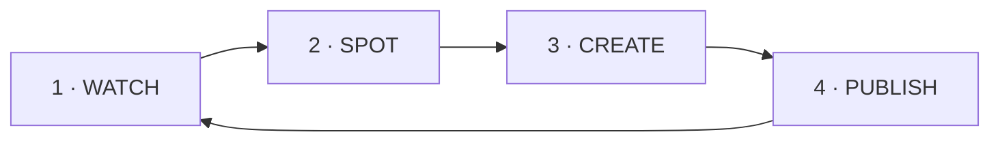

<!--
ReelSpy pitch deck.
Render to PDF/PPTX/HTML with Marp:
  npx @marp-team/marp-cli docs/product/03-pitch-deck.md -o reelspy.pdf
  npx @marp-team/marp-cli docs/product/03-pitch-deck.md -o reelspy.pptx
  npx @marp-team/marp-cli docs/product/03-pitch-deck.md -o reelspy.html
Or open in VS Code with the "Marp for VS Code" extension and Export.
-->

# 🎬 ReelSpy

### Your unfair advantage for short-form video

*Spot what's going viral. Create it in your voice. Post it everywhere.*

---

## The short-form game is a guessing game

- 😩 You learn what worked **after** it's old news
- 🕵️ Stalking competitors burns hours
- ✍️ Blank page every time you need a script
- 🔁 Re-uploading the same video to 4 platforms
- 💬 Chasing "link please" comments by hand

---

## ReelSpy turns guessing into a loop

**Watch** the right creators → **Spot** what's rising →
**Create** original scripts → **Publish** everywhere

---

## 1 · Watch

Add the accounts that inspire you.
Group them — *Angular*, *Memes*, *Fitness*.

ReelSpy imports their reels automatically and keeps them fresh.

---

## 2 · Spot what's hot 🔥

**Virality score** on every reel
→ comments count most, likes next, views least.

**"Rising Now"** ranks by *growth-per-hour*
→ catch the rocket while it's still climbing.

---

## 3 · Create in your voice 🤖

🎙️ **Transcribe** any reel → study its exact hook
📚 **Hook Library** → every winning opener in one place
✍️ **Claude AI** writes you an original **hook + body + CTA**

*Your topic. Your angle. Never a copy.*

---

## 4 · Publish everywhere 🚀

Upload **once** → post to
**Instagram · Facebook · TikTok · YouTube**

Per-platform captions. Scheduling. Public/private control.

---

## Bonus: grow on autopilot

💬 **Comment-to-DM** — keyword → instant public reply **+** DM with your link, 24/7 (IG & YouTube)

📈 **My IG** — analytics on your own account **+ 5 data-driven AI growth tips**

---

## Built right under the hood

- ⚡ **Next.js 16 + Supabase + Vercel** — fast, serverless
- 🧠 **Claude · Whisper** — best-in-class AI
- 🔒 **Row-level security** — your data is yours, tokens never hit the browser
- 🛡️ **Smart rate-limiting** — shared cache + circuit breaker keeps it reliable at scale

---

## The before / after

| Without | With ReelSpy |
|---|---|
| Hunt for trends | Trends ranked for you |
| Guess the hook | See it, transcribed |
| Blank page | Script in seconds |
| Upload 4× | Upload once |
| Miss leads | Auto-reply + DM |

---

# 🎬 ReelSpy

### Research → Inspiration → Script → Publish → Engage
### …in one tool.

**Connect Instagram. Add accounts. Hit Sync.**
